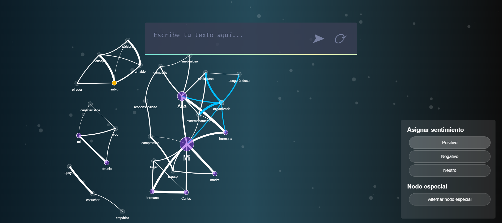

# NodeSense

NodeSense is an interactive web application designed to analyze text and visualize it as co-occurrence graphs, with the ability to assign sentiments (positive, negative, neutral) to nodes and highlight special nodes.

NodeSense aims to provide a practical and visual tool for applying George Kelly's Personal Construct Theory to understand and organize personal discourse. Special nodes are designed to highlight personal relationships and self-references of the person generating the speech, making it easier to identify and analyze the underlying constructs within the discourse. This serves as a visual alternative to Kelly's Grid, offering a more intuitive way to explore and interpret personal constructs. Ongoing development includes features for identifying constructs within nodes and connecting these constructs to special nodes.



## Table of Contents

- [Features](#features)
- [Installation](#installation)
- [Usage](#usage)
- [Project Structure](#project-structure)
- [Contributing](#contributing)
- [License](#license)

## Features

- Text analysis in both English and Spanish.
- Analyze text to generate co-occurrence graphs.
- Assign sentiments (positive, negative, neutral) to nodes.
- Ability to add/remove nodes and edges.
- Option to highlight special nodes.
- Interactive and user-friendly interface.

## Installation

### Prerequisites

- Python 3.x
- Flask
- Vis Network
- Particles.js

### Steps

1. Clone the repository:
   ```bash
   git clone https://github.com/leomirkin/NodeSense.git
2. Navigate to the project director:
   ```bash
   cd nodesense
3. Install the required Python packages:
   ```bash
   pip install -r requirements.txt
4. Run the Flask application:
   ```bash
   flask run

## Usage 

1. Open your web browser and navigate to http://127.0.0.1:5000/.
2. Enter text in the input field and press Enter or click "Analyze".
3. Interact with the generated network:
- Click nodes to select them
- Use Ctrl+Click to create edges between nodes.
- Use the sentiment panel to assign sentiment to nodes.
- Use the "Toggle Special Node" button to highlight important concepts.

## Project Structure
- 'app.py': The main Flask application file.
- 'index.html': The main HTML file for the application.
- 'script.js': JavaScript file containing the logic for handling the graph and interactions.
- 'styles.css': The man CSS file for the application.
- 'particles.js': JavaScript file containing style particles to give an 'Under the Water / Hydrocephalus effect'

## Contributing
Feel welcome to contribute! follow these steps:

Fork the repository.
Create a new branch (git checkout -b feature-branch).
Make your changes and commit them (git commit -m 'Add new feature').
Push to the branch (git push origin feature-branch).
Create a new Pull Request.

## License
This project is licensed under the MIT License - see the [LICENSE](#NodeSense/LICENSE) file for details.
